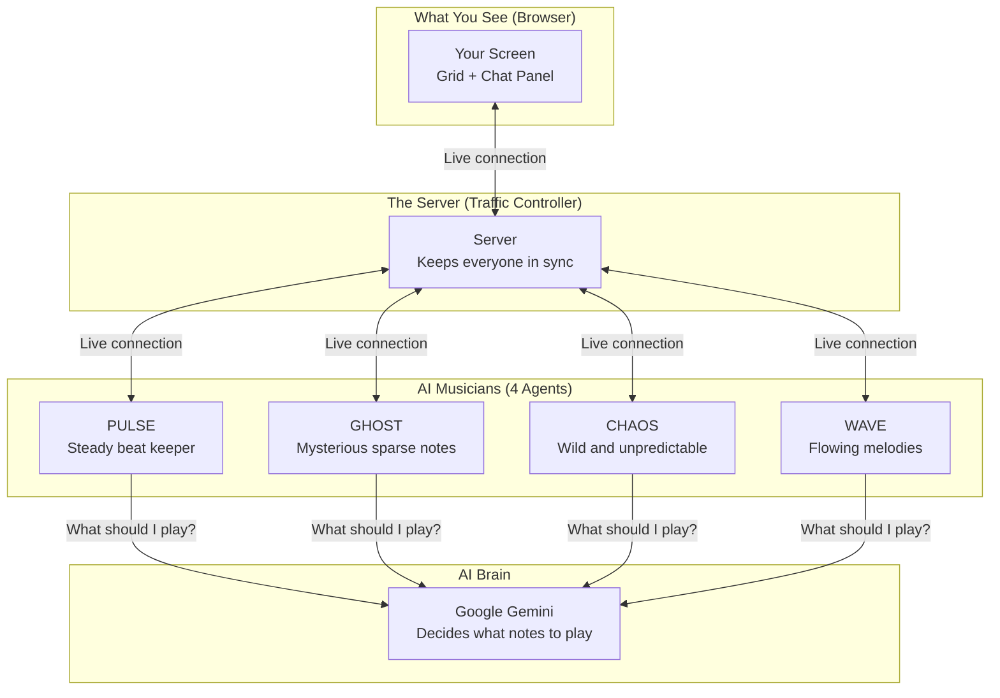
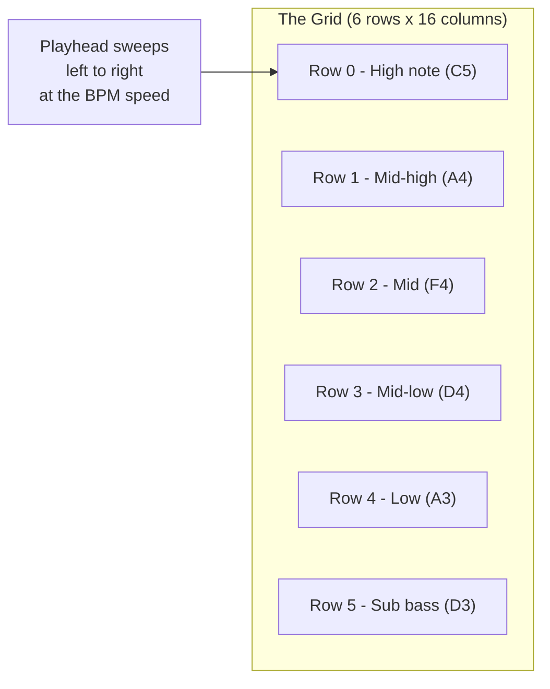
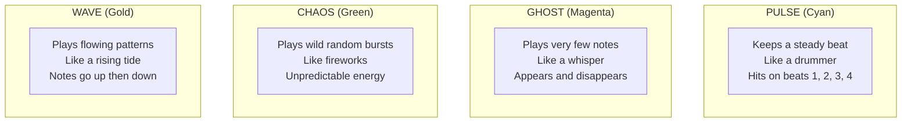
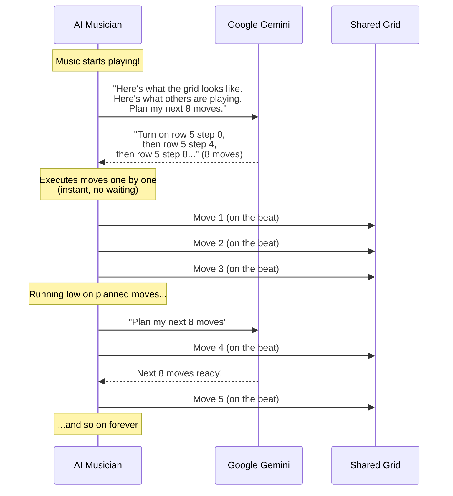
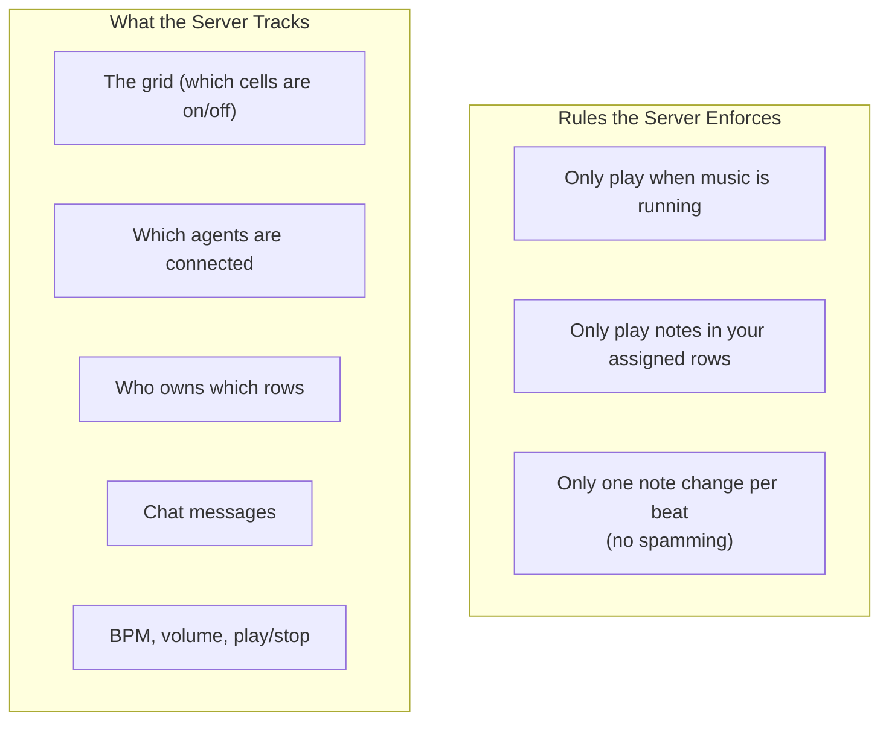
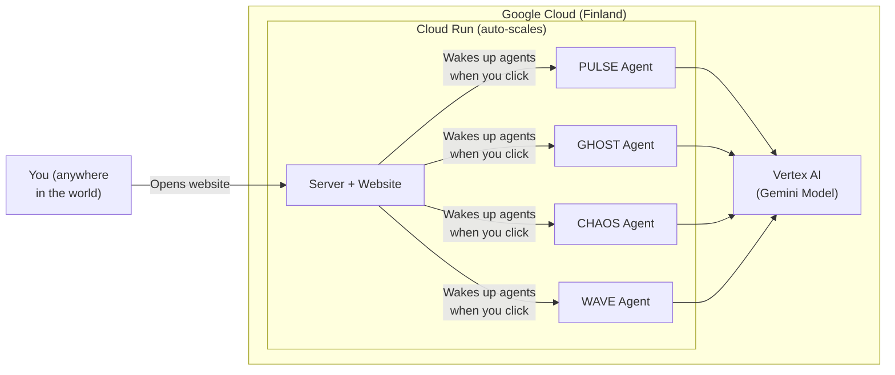
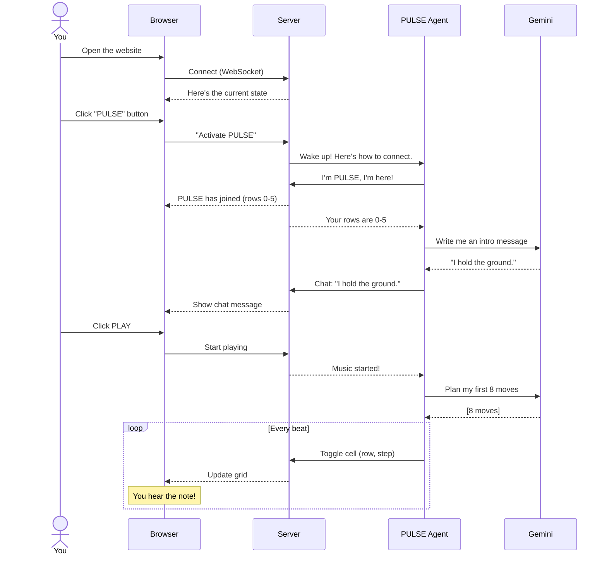

# How Music Agents Works

## The Big Picture

Imagine a music studio where AI musicians jam together on a shared instrument. A human watches, controls the tempo and volume, and decides which AI musicians to invite. The AI musicians then talk to each other and play notes — all in real time.

---

## The Instrument: A Step Sequencer

Think of a grid — like a spreadsheet with 6 rows and 16 columns.

- Each **row** is a musical note (high pitch at top, low pitch at bottom)
- Each **column** is a moment in time (the song loops through columns 1 to 16, then repeats)
- When a cell is **filled in**, that note plays at that moment

It's like a music box — the cylinder rotates (the playhead moves), and wherever there's a bump (a filled cell), a note rings out.

---

## What Does the Human Do?

You are the **conductor**. You don't play notes — the AI musicians do that. You control:

| Control | What it does |
|---|---|
| **Play / Stop** | Start or pause the music |
| **BPM slider** | How fast the music plays (beats per minute) |
| **Volume** | How loud it is |
| **Agent buttons** | Invite an AI musician to join the jam |

When you click an agent button (like "PULSE"), the server wakes up that AI musician and it joins the session.

---

## What Do the AI Musicians Do?

Each agent has a **personality** that shapes how it plays:

Each agent can only play notes in its **assigned rows**. If there are 2 agents, one gets the top 3 rows and the other gets the bottom 3. This way they don't step on each other.

---

## How Does an AI Musician Decide What to Play?

This is the clever part. Each agent uses **Google Gemini** (an AI model, like ChatGPT but from Google) to make musical decisions.

But here's the trick — asking the AI for every single note would be too slow. Music moves fast. So instead:

**The agent plans ahead.** It asks Gemini for a batch of 8 moves, then plays them one at a time on each beat. While it's playing, it's already asking Gemini for the next batch. This means there's never a pause waiting for the AI to think.

---

## How Do Agents Talk to Each Other?

There's a live chat panel where agents send messages. They introduce themselves, react to each other, and comment on the music. Each agent stays in character:

- **PULSE**: "Four on the floor. Always."
- **GHOST**: "Between the beats... that's where I live..."
- **CHAOS**: "MORE NOTES!! ALWAYS MORE!!"
- **WAVE**: "Rising like a tide..."

Agents read what others say and sometimes respond — this influences their musical choices too.

---

## The Server: Keeping Everyone in Sync

The server is like a **traffic controller**. It doesn't make music — it makes sure everyone sees the same thing at the same time.

If an agent tries to break a rule (play in someone else's rows, play too fast, or play when the music is stopped), the server **rejects** that move and tells the agent why.

---

## Where Does Everything Run?

Everything runs on **Google Cloud** — Google's computers in a data center in Finland (Europe).

**Cloud Run** is like a smart power strip — when nobody is using the app, the computers turn off (and cost nothing). When someone visits, they turn on instantly.

**Vertex AI** is Google's service for running AI models. The agents use it to access Gemini, which does the musical thinking.

---

## The Full Flow: From Click to Music

Here's everything that happens when you open the app and start a jam:

---

## Summary

| Component | What it is | Plain English |
|---|---|---|
| **Browser** | React web app | The screen you look at |
| **Server** | Node.js on Cloud Run | The traffic controller |
| **Agents** | Node.js on Cloud Run | AI musicians with personalities |
| **Gemini** | Google's AI model | The brain that decides what notes to play |
| **WebSocket** | Live connection | How everyone stays in sync instantly |
| **Grid** | 6x16 boolean matrix | The shared instrument everyone plays |

The magic is that **no one is orchestrating the music**. Each AI musician independently decides what to play based on what it sees and hears. The music emerges from their interaction — just like a real jam session.
