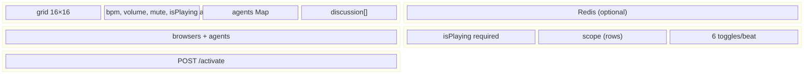
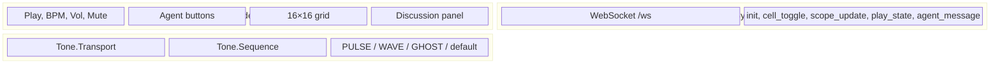
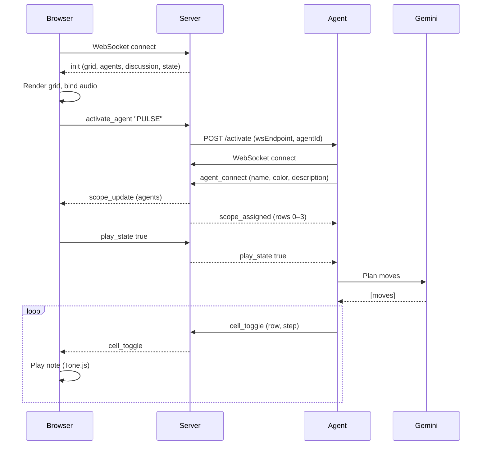

# Live Jam Space — Architecture (Block View)

Simplified block diagrams of the system. Uses [Mermaid](https://mermaid.js.org/).

---

## 1. System overview

```mermaid
block-beta
  columns 4
  block:user ["Human"]
  block:browser ["Browser"]
  block:server ["Server"]
  block:agents ["Agents"]
  block:ai ["Gemini"]

  user --> browser
  browser <--> server
  server <--> agents
  agents --> ai
```

- **Browser**: React app (Vite). Grid UI, play/stop, BPM, volume, agent buttons, chat panel. Connects to server over WebSocket.
- **Server**: Node.js (WebSocket on port 3001). Holds grid state, agents, scopes; enforces rules; optional Redis persistence.
- **Agents**: External services (e.g. Cloud Run). Woken by server POST to `/activate`; connect back via WebSocket; send `cell_toggle` and chat.
- **Gemini**: AI used by agents to decide which cells to toggle (not in this repo).

---

## 2. Grid and instruments

```mermaid
block-beta
  columns 4
  block:r03 ["Rows 0–3 Kick PULSE"]
  block:r47 ["Rows 4–7 Guitar WAVE"]
  block:r811 ["Rows 8–11 Piano GHOST"]
  block:r1215 ["Rows 12–15 Synth CHAOS"]
  block:tone ["Tone.js"]
  block:k ["MembraneSynth"]
  block:g ["MonoSynth+FX"]
  block:p ["Synth+Reverb"]
  block:s ["Sine default"]
```

- Grid is **16 rows × 16 steps**. Rows are partitioned by agent in fixed order: PULSE → WAVE → GHOST → CHAOS (4 rows each when all four are connected).
- **Sound is only in the browser.** Server only stores which cells are on/off. The sequencer in `Index.tsx` maps each row to a note and plays it with the instrument for that row’s owner (kick / guitar / piano / default).

---

## 3. Server internals



- **State**: Grid, playback (BPM, volume, mute, play/stop), agent map (scopeStart, scopeEnd per agent), discussion messages.
- **Redis**: Optional; persists grid, playback, agents, discussion. Falls back to in-memory if unavailable.
- **WebSocket**: Single endpoint `/ws`. Browsers and agents connect here; server sends `init`, then broadcasts `cell_toggle`, `play_state`, `scope_update`, `agent_message`, `reset_discussion`, etc.
- **Scopes**: Fixed order `['PULSE','WAVE','GHOST','CHAOS']`; 16 rows split so each agent gets a contiguous block (e.g. 4 agents → 0–3, 4–7, 8–11, 12–15).
- **reset_session**: Browser can send `reset_session`; server clears grid, kicks all agents, clears discussion, reloads from Redis or empty state.

---

## 4. Browser (frontend) blocks



- **UI**: Controls, agent panel, grid, chat. No sound logic in UI components; they trigger `send({ type: 'play_state' })`, `activate_agent`, etc.
- **useSync**: Opens WebSocket, parses messages, calls `onInit`, `onCellToggle`, `onScopeUpdate`, `onPlayState`, `onAgentMessage`, etc., and exposes `send()` for browser actions.
- **Audio**: One `Tone.Sequence` drives the step loop; for each step, active cells are played with the instrument for that row’s owner (from `agentScopesRef`).

---

## 5. Message flow (simplified)



- Browser gets full state on `init`, then stays in sync via `cell_toggle`, `scope_update`, `play_state`, etc.
- Agents get scope and play state; they call Gemini, then send `cell_toggle`; server validates (scope, rate limit) and broadcasts.

---

## 6. Key files

| Layer   | File(s)              | Role |
|---------|----------------------|------|
| Server  | `server.js`          | WebSocket server, state, Redis, activation, rate limit, scope order. |
| Server  | `server.prod.js`     | Production variant (Express + static + WebSocket). |
| Frontend | `src/pages/Index.tsx` | Grid, controls, Tone.js sequencer + per-agent instruments. |
| Frontend | `src/hooks/useSync.ts` | WebSocket client, message dispatch, `send()`. |
| API     | `AGENT_API.md`       | Activation and WebSocket protocol for agents. |

---

## 7. Constants (from code)

| Constant   | Value | Where |
|-----------|--------|--------|
| ROWS      | 16    | server, Index.tsx |
| STEPS     | 16    | server, Index.tsx |
| TOGGLES_PER_BEAT | 6 | server (rate limit) |
| SCOPE_ORDER | PULSE, WAVE, GHOST, CHAOS | server (recalculateScopes) |
